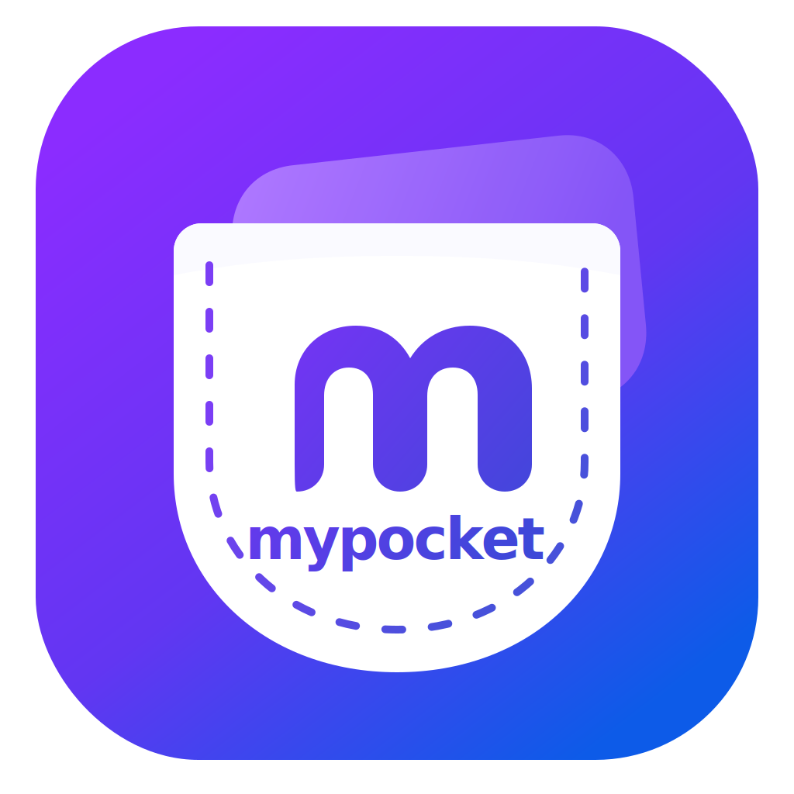

<p align="center">
  
</p>

<h1 align="center">mypocket</h1>

Extensión Manifest V3 para guardar y organizar enlaces localmente. Los datos viven en IndexedDB mediante Dexie y no salen del navegador.

## Navegadores soportados

mypocket funciona en navegadores basados en Chromium con soporte para extensiones Manifest V3:

- Google Chrome
- Microsoft Edge
- Brave
- Opera
- Vivaldi
- Otros navegadores basados en Chromium

Firefox y Safari no están soportados actualmente.

## Instalación desde GitHub Releases

1. Descarga el ZIP de la [versión más reciente](https://github.com/Suk3t/Mypocket/releases/latest).
2. Descomprime el archivo ZIP.
3. Abre la página de extensiones de tu navegador:
   - Chrome, Brave y Vivaldi: `chrome://extensions`
   - Edge: `edge://extensions`
   - Opera: `opera://extensions`
4. Activa el **Modo desarrollador**.
5. Selecciona **Cargar descomprimida**.
6. Selecciona la carpeta que descomprimiste.

## Instalación desde el código fuente

```bash
git clone https://github.com/Suk3t/Mypocket.git
cd Mypocket
npm install
npm run build
```

Después carga la carpeta `dist` desde la página de extensiones del navegador.

## Desarrollo

```bash
npm install
npm run dev
```

## Funciones

- Guardar manualmente un enlace o precargar la pestaña activa.
- Abrir una biblioteca amplia en una pestaña nueva.
- Editar y eliminar enlaces.
- Marcar favoritos.
- Buscar por título, URL o etiqueta.
- Filtrar por etiqueta y favoritos.
